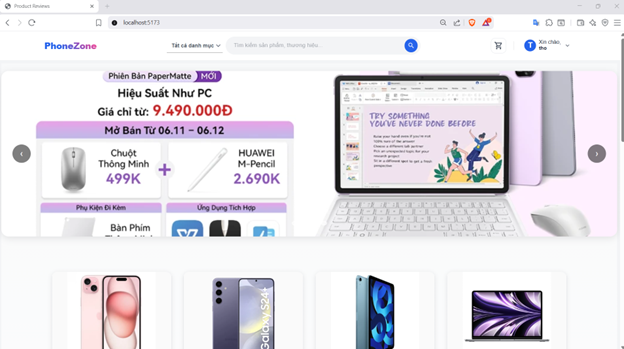
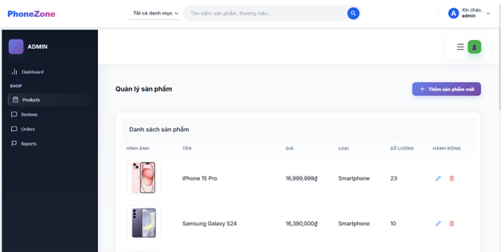
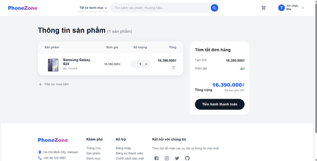

🚀 Hệ Thống Quản Lý Đánh Giá Sản Phẩm (Product Review & Management System)
Chào mừng bạn đến với dự án Product Review System. Đây là một giải pháp Backend toàn diện được xây dựng trên nền tảng Node.js, tập trung vào việc quản lý vòng đời sản phẩm, quy trình đặt hàng và hệ thống đánh giá đa chiều giữa người dùng và quản trị viên.

📌 Tổng Quan Kiến Trúc
Dự án tuân thủ kiến trúc Monolithic với mô hình phân lớp MVC (Model-View-Controller). Logic nghiệp vụ được đóng gói trong các Controllers, đảm bảo tính đóng gói và dễ dàng theo dõi luồng dữ liệu.

Hệ thống sử dụng kiến trúc MERN Stack (MongoDB, Express, React, Node.js):

Backend: API RESTful đóng vai trò là tầng xử lý logic nghiệp vụ và dữ liệu.

Frontend: Single Page Application (SPA) xây dựng bằng React, tối ưu giao diện với Material UI.

Proxy: Sử dụng Vite Proxy để kết nối mượt mà giữa Frontend (Port 5173) và Backend (Port 4000).

📂 Cấu Trúc Tổng Quan Dự Án
Hệ thống được chia làm hai phần chính:

Backend (/BE_noSQL-main): API RESTful xử lý logic nghiệp vụ và cơ sở dữ liệu.

Frontend (/product-reviews): Giao diện Single Page Application (SPA) hiện đại.

🛠 Công Nghệ Sử Dụng ở Frontend
Dự án tích hợp các công nghệ Frontend hiện đại:

Vite: Công cụ build siêu nhanh cho dự án React.

React Router Dom: Quản lý điều hướng trang (Home, Product, Cart, Admin Dashboard).

Material UI (MUI): Framework UI cung cấp hệ thống giao diện chuẩn và chuyên nghiệp.

Context API (AuthContext): Quản lý trạng thái đăng nhập và thông tin người dùng toàn cục.

📂 Hệ Thống Route & Tính Năng Frontend

1. Phân Hệ Người Dùng (User Portal)
   Trang Chủ & Danh Sách: Hiển thị sản phẩm đa dạng (/, /products).

Chi Tiết Sản Phẩm: Hiển thị thông tin, hình ảnh và danh sách đánh giá từ người dùng (/product/:id).

Giỏ Hàng & Thanh Toán: Quy trình mua hàng khép kín từ chọn hàng đến nhập thông tin thanh toán (/cart, /checkout).

Xác Thực: Đăng ký và đăng nhập bảo mật (/login, /register).

2. Phân Hệ Quản Trị (Admin Panel)
   Tất cả các route admin đều được bảo vệ bởi lớp ProtectedRoute (chỉ admin mới có quyền truy cập):

Dashboard: Tổng quan hoạt động hệ thống (/admin).

Quản Lý Phản Hồi: Xem và trả lời các thắc mắc của khách hàng (/admin/replies).

Thông Báo: Quản lý các báo cáo vi phạm và hệ thống thông báo (/admin/notifications).

Quản Lý Kho: CRUD sản phẩm trực tiếp trên giao diện (/admin/products).

🛠 Công Nghệ Sử Dụng Backend
Runtime: Node.js.

Framework: Express.js.

Database: MongoDB với thư viện Mongoose ODM.

Authentication: JSON Web Token (JWT) & Bcryptjs.

File Handling: Multer (xử lý upload) & File System (fs).

📂 Cấu Trúc Thư Mục Chức Năng Backend
Hệ thống được chia thành các khối chức năng chính:

1. Quản Lý Sản Phẩm & Danh Mục (productController.js, categoryController.js)
   Hỗ trợ CRUD sản phẩm với đầy đủ thông tin: tên, mô tả, giá, kho hàng (stock).

Tính năng Soft Delete (Xóa mềm) và khôi phục sản phẩm.

2. Hệ Thống Đánh Giá & Phản Hồi (reviewController.js, replyController.js, adminReplyController.js)
   Điều kiện đánh giá: Chỉ người dùng đã mua sản phẩm và đơn hàng ở trạng thái completed mới có quyền để lại đánh giá.

Đa phương tiện: Hỗ trợ upload nhiều ảnh cho mỗi review.

Tương tác: Cho phép Admin phản hồi review và User trả lời lẫn nhau tạo thành luồng thảo luận (threaded replies).

Tự động hóa: Tự động tính toán lại điểm trung bình (avgRating) và tổng số review của sản phẩm mỗi khi có thay đổi.

3. Quy Trình Mua Hàng (cartController.js, orderController.js)
   Giỏ hàng: Kiểm tra tồn kho thực tế (stock) ngay khi cập nhật số lượng trong giỏ hàng.

Đơn hàng: Quản lý trạng thái đơn hàng từ pending đến completed hoặc cancelled.

Thanh toán: Hỗ trợ nhiều phương thức (COD, Online) và quản lý trạng thái thanh toán.

4. Kiểm Soát Nội Dung & Báo Cáo (reportReviewController.js)
   Cho phép người dùng báo cáo các đánh giá vi phạm.

Admin có quyền: Ẩn review, cảnh cáo người dùng (warning count), hoặc bác bỏ báo cáo.

Đảm bảo tính nhất quán dữ liệu: Khi ẩn review vi phạm, hệ thống tự động loại bỏ khỏi mảng cached reviews trong Product và tính toán lại điểm meta.

5. Quản Trị Hệ Thống (authController.js, backupController.js)
   Phân quyền: Phân biệt rõ rệt quyền hạn giữa User và Admin.

⚙️ Hướng Dẫn Cài Đặt
Clone repository:

Bash

git clone <your-repo-url>
cd <your-project-folder>

1. Cấu hình Backend
   Di chuyển vào thư mục backend: cd BE_noSQL-main

Cài đặt thư viện: npm install

Tạo file .env và cấu hình:

PORT=4000
MONGO_URI=mongodb://localhost:27017/ten_database_cua_ban
JWT_SECRET=ma_bi_mat_cua_ban

Chạy server: npm run dev

2. Cấu hình Frontend
   Di chuyển vào thư mục frontend: cd product-reviews

Cài đặt thư viện: npm install

Chạy ứng dụng: npm run dev (Ứng dụng sẽ chạy tại http://localhost:5173)

# Chế độ phát triển

npm run dev

# Chế độ production

npm start

🛠 Các Điểm Mạnh Về Kỹ Thuật (Technical Highlights)
Data Integrity: Sử dụng mongoose.aggregate để đảm bảo độ chính xác tuyệt đối khi thống kê báo cáo và tính toán rating.

Resource Cleanup: Tự động xóa tập tin vật lý trên ổ đĩa khi sản phẩm hoặc đánh giá bị xóa hoàn toàn, tránh lãng phí tài nguyên server.

## Giao diện hệ thống

### Trang chủ

### Chi tiết sản phẩm

### Quản lý Admin

### Giỏ hàng

